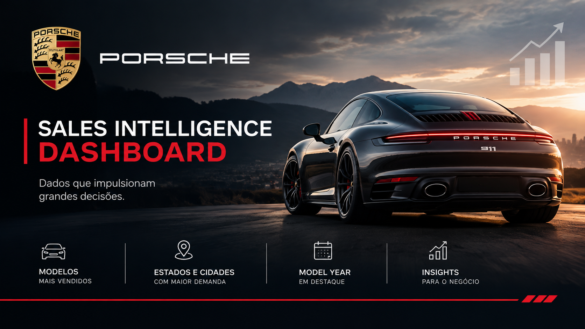

# Porsche Sales Intelligence Dashboard

Dashboard interativo de vendas desenvolvido durante o curso Excel com IA da DIO, combinando análise de dados, visualização e Inteligência Artificial para geração de insights de negócio.

## Dashboard Online

👉 https://alessandroo-rgb.github.io/dashboard_porsche_sales/

## Sobre o Projeto

Este projeto demonstra como a Inteligência Artificial pode ser aplicada além da geração de texto, apoiando todo o processo de desenvolvimento de uma solução de dados.

A IA foi utilizada para:

- Refinamento de prompts
- Tratamento e estruturação dos dados
- Definição de métricas de negócio
- Desenvolvimento da interface
- Geração de insights comerciais
- Construção e publicação do dashboard

O resultado é uma aplicação interativa capaz de transformar dados em informações para apoio à tomada de decisão.

## Funcionalidades

- Filtros por Modelo, Ano, Cidade e Forma de Pagamento
- KPIs executivos
- Ranking dos modelos mais vendidos
- Análise por Estado e Cidade
- Distribuição por Model Year
- Insights automáticos de negócio

## Perguntas de Negócio

- Quais modelos apresentam maior volume de vendas?
- Qual Model Year concentra mais vendas?
- Quais estados e cidades possuem maior participação?
- Quais padrões comerciais podem ser identificados nos dados?

## Principal Aprendizado

A Inteligência Artificial não é apenas uma ferramenta para geração de texto. Quando utilizada com prompts bem estruturados e conhecimento de negócio, ela pode aumentar significativamente a produtividade na análise de dados, no tratamento de bases e no desenvolvimento de soluções analíticas completas.

## Autor

Alessandro Oliveira

LinkedIn:
https://www.linkedin.com/in/alessandro-oliveira1/
